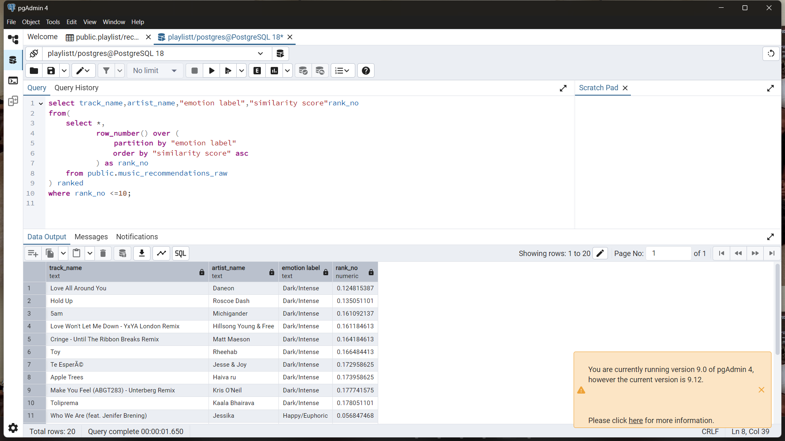
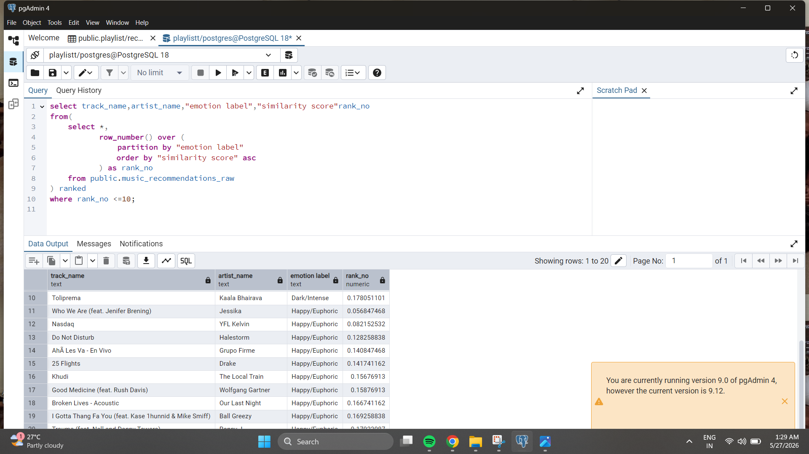

# Spotify User Behavior & Emotional Pattern Analysis

> **A data analytics project that turns Spotify listening history into behavioral insights, emotional segments, and SQL-based recommendation signals.**

[](#tech-stack)
[](#business-use-cases)

---

## 🎯 Project at a Glance

**Business question:** *How can listening behavior, emotional preference, and time-based patterns be translated into more personalized music recommendations?*

This project analyzes Spotify listening history to identify:

- 🎧 **What** the user listens to
- 🧠 **How** listening behavior maps to emotional categories
- ⏰ **When** the user is most engaged
- 🔁 **Which** behavioral patterns can support personalized recommendations

The final workflow combines **data preparation → feature engineering → analytical modeling → dashboarding → recommendation logic**.

---

## 💡 Key Findings

| Area | Finding |
|---|---|
| **Energy preference** | Average track energy is ~**0.73**, indicating a strong preference for energetic music |
| **Emotional profile** | A large share of listening falls into **high-energy emotional categories** |
| **Time of day** | Listening peaks during **morning and early afternoon** |
| **Late night** | Listening activity is comparatively lower |
| **Weekly behavior** | Day-to-day variation is limited, with slightly higher weekday engagement |
| **Monthly behavior** | Listening increases around mid-year and then remains relatively stable |

> **Takeaway:** Listening behavior shows consistent patterns across **emotion + time + behavior**, creating useful signals for personalization.

---

## 🧩 Analytical Workflow

```text
Spotify Listening History
          │
          ▼
┌─────────────────────┐
│ Data Preparation    │
│ KNIME               │
└──────────┬──────────┘
           ▼
┌─────────────────────┐
│ Feature Engineering │
│ Time + Emotion       │
└──────────┬──────────┘
           ▼
┌─────────────────────┐
│ Behavioral Analysis │
│ SQL + Power BI       │
└──────────┬──────────┘
           ▼
┌─────────────────────┐
│ Recommendation      │
│ Signals             │
└─────────────────────┘
```

---

## 🛠️ Tech Stack

| Tool | Purpose |
|---|---|
| **SQL** | Analytical queries, ranking, recommendation logic |
| **KNIME** | Data cleaning, joining, transformation and feature engineering |
| **Power BI** | Interactive behavioral and emotional analysis |
| **Spotify API** | Track-level audio features such as energy and valence |
| **CSV** | Analytical dataset / output |

---

## 1. 📥 Data Collection

The project combines Spotify listening history with track-level audio features.

**Core inputs include:**
- Listening history
- Track metadata
- **Energy**
- **Valence**

These features provide the foundation for behavioral and emotional segmentation.

---

## 2. 🧹 Data Preparation — KNIME

The KNIME workflow handles the main data preparation layer:

- Joined multiple datasets using **Joiner** nodes
- Selected and cleaned relevant columns
- Handled missing track-feature data using **genre-based averages**
- Applied a **global fallback** where genre-level information was unavailable
- Aggregated the resulting data for downstream analysis

This produces a cleaner analytical dataset while preserving as much listening history as possible.

---

## 3. 🧠 Feature Engineering

### Time-based features

The dataset was enriched with:

- Time of Day
- Day Name
- Month Name
- IsWeekend

### Emotion classification

Tracks are categorized using **energy + valence** into:

| Emotion Segment | Interpretation |
|---|---|
| 🌑 **Dark / Intense** | High energy + lower valence |
| ⚡ **Happy / Euphoric** | High energy + higher valence |
| 🌊 **Calm / Peaceful** | Lower energy + higher valence |
| 🌧️ **Sad / Melancholic** | Lower energy + lower valence |

This converts raw audio features into **behaviorally meaningful segments** that can be analyzed and used as recommendation signals.

---

## 4. 📊 Dashboard Analysis

The Power BI layer focuses on four questions:

### User Profile
Understand the user's overall listening intensity and emotional distribution.

### Time Patterns
Identify when listening activity is highest and lowest.

### Monthly Trends
Track how listening behavior changes over time.

### Weekly Patterns
Compare weekday and weekend behavior to identify routine-driven usage.

---

## 5. 🎵 Recommendation Logic

A SQL-based recommendation layer ranks tracks **within each emotional category**.

### Approach

1. Assign each track an emotion label
2. Calculate / use a track similarity score
3. Partition tracks by emotion
4. Rank tracks using `ROW_NUMBER()`
5. Select the **Top N tracks** from each emotional category

Conceptually:

```sql
ROW_NUMBER() OVER (
    PARTITION BY emotion_label
    ORDER BY similarity_score DESC
)
```

### Example

If a user's dominant preference is **Dark / Intense**, the recommendation layer can surface the highest-ranked tracks from that emotional segment.

This is a **rule-based analytical recommendation layer**, not a production machine-learning recommender.

---

## 🖼️ Recommendation Outputs

### Recommendation Playlist 1



### Recommendation Playlist 2



---

## 📈 Business Use Cases

### 🎯 Personalization
Use emotional preference alongside listening behavior rather than relying only on popularity.

### ⏰ Time-aware recommendations
Align playlist suggestions with observed listening periods.

### 🔁 Engagement
Use repeat listening and behavioral consistency as signals for relevant content.

### 🎧 Content strategy
Identify niche or mid-popularity tracks that fit a user's established preferences.

---

## 📁 Repository Structure

```text
Spotify-User-Behavior-Emotional-Pattern-Analysis/
│
├── 📄 README.md
├── 📊 dataset/
│   └── emotionanalysis.csv
│
├── 🔄 knime workflow/
│   └── knime.knwf
│
├── 🧹 knime/
│   └── screenshot/
│
├── 📈 powerbi/
│   ├── dashboard/
│   └── screenshots/
│
├── 🎵 play1.png
└── 🎵 play2.png
```

---

## 🔍 What This Project Demonstrates

**Data Analytics**
- Data cleaning and transformation
- Feature engineering
- Behavioral segmentation
- Trend analysis

**SQL**
- Window functions
- Partitioning
- Ranking
- Recommendation logic

**BI / Visualization**
- KPI-driven dashboard analysis
- Time-based behavioral analysis
- Emotional segmentation

**Business Thinking**
- Translating raw listening data into actionable analytical signals
- Connecting user behavior to personalization opportunities

---

## 🚀 Final Takeaway

This project demonstrates how a relatively simple listening-history dataset can be transformed into a structured analytics workflow:

**Raw Data → Clean Data → Behavioral Features → Emotional Segments → Dashboard Insights → Recommendation Signals**

The result is a practical example of using **SQL, KNIME, Power BI, and Spotify audio features** to understand user behavior and explore personalization opportunities.

---

### 👤 Project

**Spotify User Behavior & Emotional Pattern Analysis**

Built as a portfolio project focused on **data analytics, behavioral insights, and recommendation systems**.
